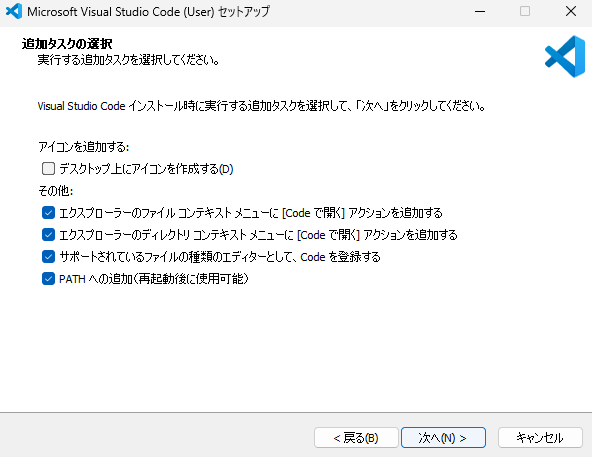

# すばる夏期講習
2023年度は8/7,8/8で実施。
## 使用するツール
- エディタ：[Visual Studio Code](https://code.visualstudio.com/) の Stable Build を使用
  - インストール時に以下の設定をしておくと便利です
  - 
  - 拡張機能
    - Live Server
      - HTMLファイルを右クリックで選択し「open with Live Server」を選択するとWebページの確認ができる
- ブラウザ：Google Chrome（Microsoft Edgeでも可）
  - F12キーを押すと開発者ツールが選択可能。その中でコントロールを選択し，JavaScriptの動きを確認可能
## モテるキーボードショートカット
|ショートカット|効果|
|----|----|
|Ctrl + S|保存|
|Ctrl + X|切り取り|
|Ctrl + C|コピー|
|Ctrl + V|貼り付け|
|Ctrl + Z|操作をひとつ戻す|
|Ctrl + Y|戻した操作をもう一度実行|
|Ctrl + F|検索|
|Ctrl + H|置換|
|Ctrl + Tab|編集中のファイルの切り替え|
|Ctrl + ,|ユーザー設定を開く|
|Ctrl + Shift + K|一行削除|
|Ctrl + Enter|行を下に挿入|
|Ctrl + Shift + Enter|行を上に挿入|
|Ctrl + ]|行のインデント|
|Ctrl + [|行のインデントを戻す|
|Ctrl + /|行コメントの切り替え|
|Alt + ↓|行を下に移動|
|Alt + ↑|行を上に移動|
|Windows + 方向キー|アクティブなウインドウの位置を指定|
|Windows + Shift + S|スクリーンショット|

## やること
### Day.1
- HTML
  - HTMLってそもそもなに？Webページって？URLって？
  - タグの意味と適切な表記について
  - 画像の扱い
- CSS
  - CSSってそもそもなに？
  - タグ名での指定
  - クラス名での指定
  - 横幅など簡単なデザインを設定
- JavaScript
  - DOMについて。部品を取ってきて使うという話
  - イベントリスナー（click）

### Day.2
- Day.1の続き
  - イベントリスナー（keydown）
  - templateタグ
- SNSっぽい表示物って？
- SNSを真似る
  - X（Twitter）に寄せる
  - Instagramに寄せる
- Server/Clientシステムについての軽い説明
- ひたすら作りこむ

## 使用したタグのざっくりした説明
|タグ名|概要|
|----|----|
|html|HTML文書であることを表現|
|head|ヘッダ情報（見せたいわけじゃない細かい設定）を記載|
|body|文書本体（見せたい部分）|
|title|ページのタイトル|
|link|関連するファイルを指定。授業ではCSSを指定|
|div|ひとかたまりの領域|
|h1~h3|見出し。数が大きいほど文字サイズが大きい|
|p|段落（パラグラフ）|
|br|改行|
|ul|順序なしのリスト|
|ol|順序ありのリスト|
|img|画像。srcでファイルのパスを指定。altで代替テキストを指定|
|script|srcで読み込むスクリプトのファイルパスを指定。基本はJavaScriptを読み込む|

## そこそこオススメのVSCode拡張機能
- Auto Rename Tag
- Code Spell Checker
- Prettier - Code formatter
- Material Icon Theme
- CSSTree validator
- Color Hgihlight
- Color Picker
- Better Comments
- Bracket Pair Colorizer
- Todo Tree
### 日本語化したい人はこちら
- Japanese Language Pack for Visual Studio Code